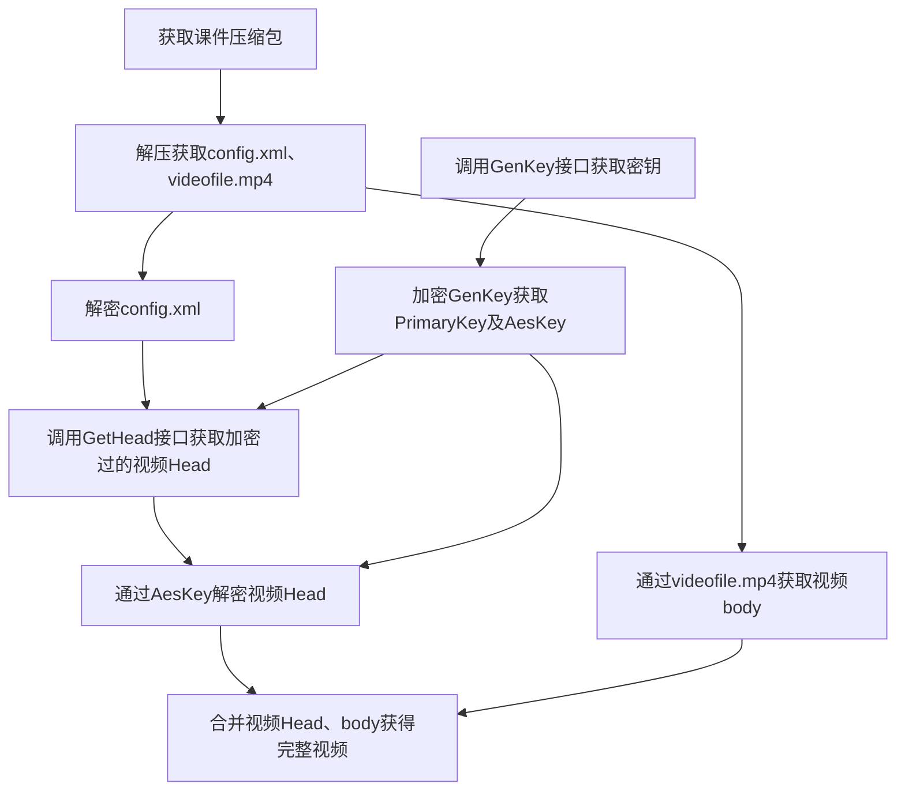

# 工具包文档

DownloadClass.Toolkit包含一系列下载课堂客户端需要的工具及服务。

调用工具包API之前需要初始化工具包：

```c#
var serviceCollection = new ServiceCollection();
serviceCollection.AddToolkit(options =>
{
    options.CurrentUser = Util.UserName;
    options.MachineKey = Crypt.MachineKey;
});

```

> AddToolkit参数为获取当前配置的回调，包含当前用户配置。

## 视频播放器控件

MediaPlayerElement包含两个属性：

- Source，代表视频的源，当前内置支持本地ZIP文件
- IsFullScreen，是否全屏，只读依赖属性，用于向调用端通知播放器是否开启全屏，调用端可据此状态调整自己的UI状态
- Position，视频当前的位置，用于调节视频的进度
- IsPlaying，是否正在播放，用于切换暂停和播放

调用示例：

```XAML
<Window x:Class="VideoPlayer.MainWindow"
        xmlns="http://schemas.microsoft.com/winfx/2006/xaml/presentation"
        xmlns:toolkit="http://cdeledu.com/winfx/toolkit"
        xmlns:d="http://schemas.microsoft.com/expression/blend/2008"
        xmlns:x="http://schemas.microsoft.com/winfx/2006/xaml"
        xmlns:mc="http://schemas.openxmlformats.org/markup-compatibility/2006"
        mc:Ignorable="d"
        Title="MainWindow"
        Height="450"
        Width="800">
    <DockPanel LastChildFill="True">
        <StackPanel DockPanel.Dock="Bottom">
            <StackPanel.Style>
                <Style>
                    <Style.Triggers>
                        <DataTrigger Binding="{Binding ElementName=MediaPlayerElement,Path=IsFullScreen}"
                                     Value="True">
                            <Setter Property="UIElement.Visibility"
                                    Value="Collapsed" />
                        </DataTrigger>
                        <DataTrigger Binding="{Binding ElementName=MediaPlayerElement,Path=IsFullScreen}"
                                     Value="False">
                            <Setter Property="UIElement.Visibility"
                                    Value="Visible" />
                        </DataTrigger>
                    </Style.Triggers>
                </Style>
            </StackPanel.Style>
            <Button x:Name="OpenZipFile"
                    Click="OpenZipFile_Click"
                    Content="打开文件" />
        </StackPanel>
        <toolkit:MediaPlayerElement x:Name="MediaPlayerElement" />
    </DockPanel>
</Window>
```

```c#
private void OpenZipFile_Click(object sender, RoutedEventArgs e)
{
    var dialog = new OpenFileDialog()
    {
        DefaultExt = ".zip",
        Filter = "下载课堂压缩包|*.zip"
    };
    bool? result = dialog.ShowDialog();
    if (result == true)
    {
        MediaPlayerElement.Source = new Uri(dialog.FileName);
    }
}
```

## Zip视频解密流程

视频课件下载后会以压缩包的形式存在，成功还原视频需要一系列的远程请求及加密解密计算。

流程图如下：



### 详细说明

#### 解密XML文件

压缩包内的xml文件经过DES加密之后又进行了一次Base64转码，所以解密代码片段如下：

```c#
using var fromBase64 = new CryptoStream(fileStream, new FromBase64Transform(), CryptoStreamMode.Read);
```

```c#
using var desProvider = new DESCryptoServiceProvider()
{
    Key = new byte[] { 0x45, 0x34, 0x48, 0x44, 0x39, 0x68, 0x34, 0x44 },
    IV = new byte[] { 0x66, 0x59, 0x66, 0x68, 0x48, 0x65, 0x44, 0x6D },
    Padding = PaddingMode.None,
    Mode = CipherMode.CBC
};
```

#### 加密GenKey

加密GenKey获取PrimaryKey及AESKey，PrimaryKey由64位的默认数组由RNG加密而来，AESKey由PrimaryKey及GenKey由MD5算法计算而来，代码片段如下：

```c#
byte[] primaryKey = new byte[64];
var rngProvider = new RNGCryptoServiceProvider();
rngProvider.GetBytes(primaryKey);
```

```c#
byte[] converted = Enumerable.Range(0, hash.Length).Where(x => x % 2 == 0)
                .Select(x => Convert.ToByte(hash.Substring(x, 2), 16))
                .ToArray();
using var md5 = new MD5Algorithm();
byte[] aeskey = md5.ComputeHash(converted.Concat(primaryKey).ToArray());
```

> MD5Algorithm为内部实现的MD5算法。

#### 调用GetHead接口

调用GetHead接口时，需要传递如下参数：

```c#
/// <summary>
 /// 用户名
 /// </summary>
 [AliasAs("userName")]
 public string Username { get; }
 /// <summary>
 /// 课件ID
 /// </summary>
 [AliasAs("cwareid")]
 public long CoursewareId { get; }
 /// <summary>
 /// 视频编号
 /// </summary>
 [AliasAs("videoid")]
 public string VideoId { get; }
 /// <summary>
 /// 打包类型
 /// </summary>
 [AliasAs("VideoType")]
 public int PackagedType { get; }
 /// <summary>
 /// 时间戳
 /// </summary>
 [AliasAs("time")]
 public long Timestamp { get; }
 /// <summary>
 /// 文件头哈希值
 /// </summary>
 [AliasAs("videoheadhash")]
 public string HeadHash { get; }
 /// <summary>
 /// 由Hash加密而来
 /// </summary>
 [AliasAs("prikey")]
 public string PrimaryKey { get; }
 /// <summary>
 /// 从GenKey接口获取的值
 /// </summary>
 [AliasAs("hash")]
 public string Hash { get; }
```

大部分内容由config.xml解密而来，字节数组到字符串的转换均使用Base64编码。

#### 解密Head

密文经过转换后，前十六位为AES算法的IV，十六位之后的内容为需要解密的Head，代码片段如下：

```c#
byte[] converted = Enumerable.Range(0, encrypted.Length)
                .Where(x => x % 2 == 0)
                .Select(x => Convert.ToByte(encrypted.Substring(x, 2), 16))
                .ToArray();

using var aesProvider = new AesCryptoServiceProvider()
{
    Key = aesKey,
    Padding = PaddingMode.None,
    IV = converted[..16]
};
using var encryptedStream = new MemoryStream(converted[16..]);
using var decryptedStream = new CryptoStream(encryptedStream, aesProvider.CreateDecryptor(), CryptoStreamMode.Read);
byte[] decrypted = new byte[converted.Length - 16];
decryptedStream.Read(decrypted);
```

#### 合并Head、Body

videofile.mp4没有经过加密，但是需要将前4kb（即4096字节）替换为解密后的head。

## cdel视频解密流程

cdel后缀的文件为下载课堂下载的zip文件解密成视频文件又进行加密的文件，适用于离线场景，从zip文件中解密出视频文件需要调用一系列Web API，不适用于离线场景。

cdel文件数据结构：

- 0-3，长度4byte，没有用处
- 4-7，长度4byte，加密内容的长度，算法为：
  ```csharp
  (BitConverter.ToInt32(encryptedLengthRaw) >> 16) * 1024
  ```
- 8-15, 长度16byte，对该视频加密内容加密用到的AES算法的IV
- 16-31，长度16byte，没有用处

剩下内容由加密部分和未加密部分组成，加密部分使用的算法为AES加密，示例代码如下：

```csharp
using FileStream? cdelStream = File.Open(cdelPath, FileMode.Open);
cdelStream.Seek(4, SeekOrigin.Current);
Span<byte> encryptedLengthRaw = stackalloc byte[4];
cdelStream.Read(encryptedLengthRaw);
var encryptedLength = (BitConverter.ToInt32(encryptedLengthRaw) >> 16) * 1024;
Span<byte> iv = stackalloc byte[16];
cdelStream.Read(iv);
cdelStream.Seek(32, SeekOrigin.Begin);
var encrypted = new byte[encryptedLength];
cdelStream.Read(encrypted);
using var aesProvider = new AesCryptoServiceProvider()
{
    Padding = PaddingMode.None,
    KeySize = 128,
    Key = aesKey,
    IV = iv.ToArray(),
};
var decrypted = aesProvider.CreateDecryptor(aesProvider.Key, aesProvider.IV).TransformFinalBlock(encrypted, 0,encryptedLength);
var buffer = new TempFileStream(Path.GetTempFileName(), FileMode.Create);
buffer.Write(decrypted);
cdelStream.CopyTo(buffer);
buffer.Seek(0, SeekOrigin.Begin);
return buffer;
```